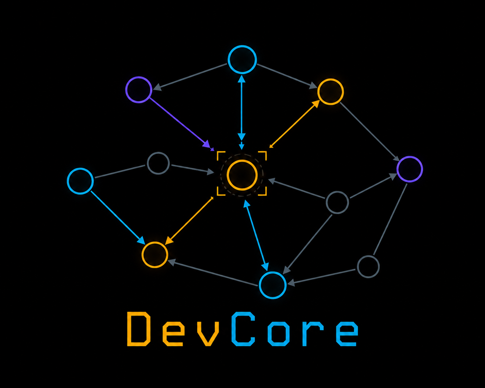

<div align="center">



# DevCore

**A self-documenting development-memory framework for [Claude Code](https://claude.com/claude-code) projects — your project's dev history as a queryable brain-graph in one SQLite file.**

`v3.0` · for Claude Code · single-developer (SQLite) · CC BY-NC-SA 4.0 · free for non-commercial use

</div>

---

## What it is

Every decision, bug, observation, idea and rule your project accumulates is usually scattered across
chat logs, commit messages and someone's memory. DevCore captures it as **typed nodes wired by typed,
directed edges** — a *brain-graph* — inside one committed SQLite file (`dev/documentation.db`).

When an agent (Claude Code) works on your project, it **recalls before it answers**: it follows the
edges from the relevant node rather than reconstructing a plausible story from the immediate context.
The graph is the memory; a flat answer is amnesia.

> **Scope.** DevCore is built for **[Claude Code](https://claude.com/claude-code)** and a **single
> developer** — the brain is one local SQLite file, no server, no concurrency layer. A multi-developer
> variant (Postgres / TimescaleDB-backed) may follow; for now DevCore targets the solo-dev workflow.

| Node | Code | Holds |
|---|---|---|
| Decision | `D###` | a settled design choice + rationale |
| Bug | `B###` | a confirmed defect (+ its fix) |
| Observation | `W###` | something noticed, not yet confirmed |
| Next-target | `NT###` | queued future work |
| Idea | `IDEA###` | a raw, not-yet-decided thought |
| Investigation / Adjudication / Resolution | `I### / Q### / RS###` | the process, the settled fact, the reusable precedent |
| Reminder | `R###` | a conditional "do X when Y" |
| Project rule | `PR###` | standing operational discipline (loaded every session) |

A `refs` table connects them with directed predicates (`raised`, `produced`, `answers`, `supersedes`,
`documents`, `relates`, …). Hooks make the disciplines mechanical (write-path enforcement, recall
surfacing, edge-on-mention). A read-only **dashboard** (`devdash`) browses it all, including an
interactive graph explorer.

### Less AI slop in your commits

Paste a patch or a "here's how to fix it" from another model and **`/dev-external-review`** vets it
**against the brain *and* the actual codebase** before anything lands: does it contradict a settled
decision (`D###`/`Q###`)? does the file or function it references even exist? is it a known bug or a
superseded approach? It's automated analysis that turns *"looks plausible"* into *"checked against
ground truth"* — so external-AI suggestions don't slip into your project unchecked.

> Architecture spec: [`DEVCORE.md`](DEVCORE.md). Detailed install recipe: [`BACKPORT.md`](BACKPORT.md).

---

## DevCore in use

<div align="center">


*A real project's entire history as one graph — every decision, bug, observation, idea and rule,
wired by typed edges: **provenance** · **lineage** (supersedes) · **lateral** (relates/informs) ·
**structural** (documents/references). Pan, zoom and ego-focus any node in the dashboard.*

</div>

---

## Two ways to use it

DevCore installs at the **root** of your repo — `CLAUDE.md`, the `dev/` brain, the `.claude/` skills +
hooks, and `devdash/`. Your actual **project lives in versioned `v_x.y/` folders**, so it can iterate
version by version while the brain (`dev/documentation.db`) at the root persists and accumulates the
whole history across every version. (This framework is built exactly that way — DevCore at the root,
its runtime in `v_2.0/`, `v_3.0/`, …)

```
your-project/
├── CLAUDE.md                ← DevCore at the root: the dev dispatcher
├── dev/                     ← DevCore brain — persists across every version
│   └── documentation.db
├── .claude/   devdash/      ← DevCore skills + hooks + dashboard (root)
├── v_0.1/   v_0.2/   …      ← your project lives here, versioned as it grows
└── …
```

### 1. Add DevCore to an existing project (backport)

You don't wire it in by hand — **Claude Code does the backport.** Open your project in Claude Code,
point it at this repo, and ask it to install DevCore. It follows [`BACKPORT.md`](BACKPORT.md): installs
the framework **at your repo root**, resolves the `{{PROJECT_NAME}}` / `{{PREFIX}}` placeholders, and
bootstraps the brain (schema + the 28 project rules) on the first `run-dev-query.sh` call — **without
touching your existing code.** From there the root brain tracks every decision, bug and rule.

Organizing your own project into `v_x.y/` version folders is **the human user's call — not the agent's.**
Only the person running the project knows whether the code carries hardcoded paths, build configs or
imports that a move would break, so **the agent must not move existing code automatically.** You (the
user) do it when and how you're ready; DevCore at the root works either way.

### 2. Start a new project with DevCore (description-first)

Drop a **`beschreibung.md`** (your project brief — what you want to build) into the root, then ask
Claude Code to start the project. It stands up **DevCore at the root first** — the brain and the dev
layer — and *then* builds your actual project into its first `v_x.y/` version folder. The result is
self-documenting from the very first commit: every choice made while bringing your project to life is
already a node in the graph, with its rationale readable in the record.

---

## Quick start (try the framework itself)

```bash
# bootstrap the brain (schema + 28 project rules auto-seed on first call)
bash dev/run-dev-query.sh count_decisions
bash dev/run-dev-query.sh get_active_projectrules     # → 28 rules

# browse it
cd devdash && pip install -r requirements.txt
DEVCORE_DB=$(pwd)/../dev/documentation.db DEVCORE_PROJECT_NAME="DevCore" \
  uvicorn main:app --host 127.0.0.1 --port 8768
# → http://127.0.0.1:8768
```

All DB access goes through `dev/run-dev-query.sh` (named queries in `dev/dev-queries/*.sql`); never
inline SQL. A PreToolUse hook enforces that path.

---

## License

[Creative Commons Attribution-NonCommercial-ShareAlike 4.0](LICENSE). **Free** to use, share and build
upon for non-commercial purposes, with attribution and share-alike. For **commercial** licensing,
contact the copyright holder.

<div align="center">

© 2026 [github.com/pr1mefact0r](https://github.com/pr1mefact0r)

</div>
